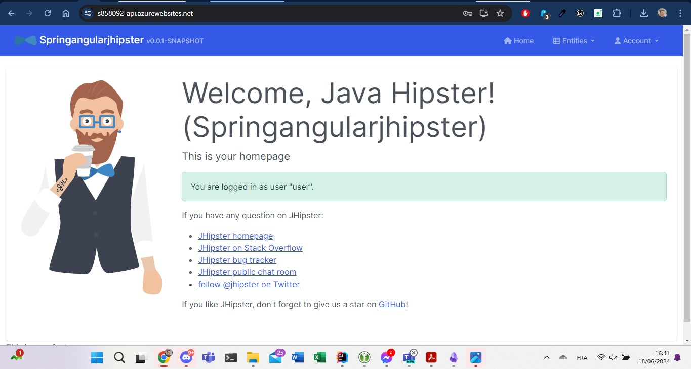
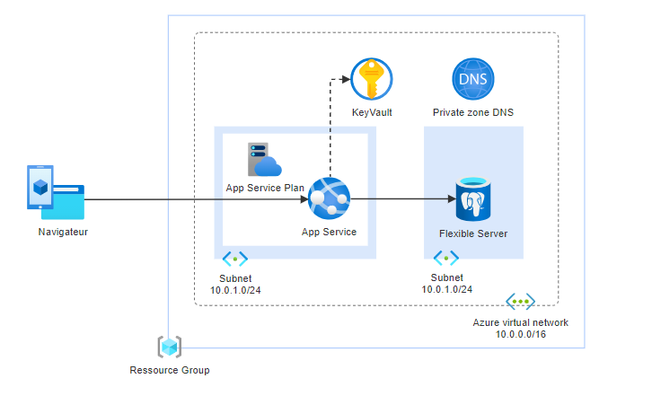
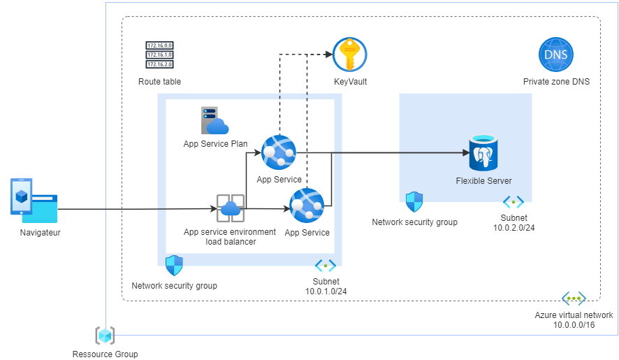

# App Spring Angular sur Azure avec Terraform

## Prérequis

- [Terraform](https://www.terraform.io/downloads.html)
- [Azure CLI](https://docs.microsoft.com/en-us/cli/azure/install-azure-cli)

## Déploiement

```
    az login
    terraform init
    terraform plan --var-file=terraform.tfvars 
    terraform apply --var-file=terraform.tfvars
```

Pour détruire l'infrastructure :

```
    terraform destroy --var-file=terraform.tfvars
```

L'url publique de l'application est affichée à la fin de l'exécution de la commande `terraform apply`.
Elle peut également être récupérée sur le portail Azure.

Une fois sur le site, il est possible de se connecter avec les identifiants suivants :
- username : admin
- password : admin

- username : user
- password : user

Il est possible que l'authentification prenne quelques secondes car les ressources choisies sont les plus économiques et peuvent mettre du temps à démarrer.

Voici le résultat de la page d'accueil une fois connecté avec l'utilisateur user :
Ici on peut voir que l'application est fonctionnelle sur l'url https://s858092-api.azurewebsites.net/



## Présentation de l'application

L'application déployée est une application web composée d'un backend spring boot et d'un frontend angular.
Il s'agit d'un hello world généré avec [JHipster](https://www.jhipster.tech/).
Ces deux applications sont intégrées dans une même image docker.
Cette image est stockée dans un registry public gitlab.

## Vue d'ensemble de la structure du projet
Les configurations de Terraform sont organisées en trois répertoires distincts, 
chacun représentant un composant spécifique de l'infrastructure. 
Cette approche modulaire aide à gérer chaque aspect séparément, améliorant ainsi la clarté et la maintenabilité.

## Répertoires :
- api/ (API) : Créer un réseau virtuel, des sous réseaux, une instance de base de données, un environnement d'exécution pour l'application.
- keyvault/ : Créer un keyvault pour stocker les secrets, comme le mot de passe de la base de données, du registry si il est privé, etc.

Cette structure de fichier tire partie de la fonctionnalité de Terraform qui permet de définir des modules indépendants et réutilisables.

## Architecture 



Les services choisis l'ont été pour leur possibilité de scalabilité, de sécurité et de facilité d'intégration.
Toutes les fonctionnalités des différents services utilisés dans ce projet peuvent être configurées pour répondre à des besoins spécifiques en matière de sécurité et de performance.

### 🏢 Hebergement de l'application

Le service Azure App Service à été choisi pour héberger l'application web.
Il a été choisi pour son offre de fonctionnalité large :

- **Hébergement Web** pour divers langages comme .NET, Java, Node.js.
- **Auto-scaling** pour optimiser les performances.
- **Intégrations** avec d'autres services Azure.
- **DevOps** avec support pour CI/CD.
- **Sécurité** avec gestion de patchs et conformité aux normes.
- **Échelle Globale** grâce à l'infrastructure d'Azure.
- **Domaines et SSL** pour une présence web sécurisée.
- **Sauvegarde et restauration** pour la protection des données.
- **Diagnostics et surveillance** pour le monitoring des applications.

Il permet la gestion des applications web simplifiée, sécurisée et scalable.

Toutes ces fonctionnalités non pas été utilisées dans ce projet, mais elles sont disponibles pour des besoins plus avancés.

Toute App service s'exécute dans un plan d'app service. Un plan d'app service définit un ensemble de ressources partagées qui sont utilisées par les applications associées.
Le App service définit notamment les caractéristiques suivantes :
- Système d’exploitation (Windows, Linux)
- Région (USA Ouest, USA Est, etc.)
- Nombre d’instances de machine virtuelle
- Taille des instances de machine virtuelle (petite, moyenne ou grande)
- Niveau tarifaire (Gratuit, Partagé, De base, Standard, Premium, PremiumV2, PremiumV3, Isolé, IsoléV2)

### 🗄️ Base de données

Azure Flexible Server for PostgreSQL est utilisé pour héberger la base de données.
Azure Flexible Server for PostgreSQL offre une plateforme de base de données flexible avec des fonctionnalités clés telles que :

- **Flexibilité de configuration** pour le contrôle fin des ressources CPU, mémoire et stockage.
- **Haute disponibilité** avec des options de configuration pour la durabilité des données.
- **Échelle** avec la possibilité d'ajuster les performances à la demande.
- **Maintenance programmable** permettant de choisir des fenêtres de maintenance pour minimiser les interruptions.
- **Sécurité** renforcée avec le support du chiffrement et des configurations réseau personnalisées.
- **Intégration** aisée avec d'autres services Azure pour une meilleure interopérabilité des données.

Cette solution est idéale pour les applications nécessitant une gestion de données robuste et adaptable.

### 🔒 Stockage des secrets 

Azure Key Vault est utilisé pour stocker les secrets de l'application.
Ce service permet la de gestion des secrets et inclut les fonctionnalités clés suivantes :
- **Gestion des secrets** pour stocker et contrôler l'accès aux tokens, mots de passe, certificats, et clés API.
- **Chiffrement des clés** pour sécuriser des clés de chiffrement utilisées pour protéger les données.
- **Gestion centralisée** pour maintenir et gérer les accès aux secrets et aux clés de chiffrement de manière centralisée.
- **Contrôle d'accès** basé sur des politiques pour définir qui peut accéder à quelles informations.
- **Journalisation** pour suivre l'utilisation des clés et des secrets pour l'audit et la conformité.

### Réseaux

Azure Virtual Network est utilisé pour isoler les ressources de l'application.
Un sous réseau A est utilisé pour App Service et un sous réseau B pour Flexible Server for PostgreSQL.

Un DNS privé est utilisé pour permettre au back end de communiquer avec la base de données en utilisant le nom de domaine privé.

## Améliorations possible

Actuellement, les deux réseaux ne sont pas isolés, mais cela peut être configuré pour renforcer la sécurité.
Des groupes de sécurité réseau peuvent être utilisés pour contrôler le trafic entrant et sortant des ressources ainsi que des tables de routage pour diriger le trafic autorisé. 

Par ailleurs, le service App Service peut être configuré pour réaliser de l'équilibrage de charge (load balancing) pour améliorer les performances et la disponibilité de l'application.

Le diagramme suivant illustre une architecture plus avancée avec ces fonctionnalités supplémentaires.



Une réplication de la base de données pourrait également être configurée pour garantir la disponibilité des données en cas de panne.


